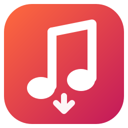

<p align="center"></p>

# SongSnag

SongSnag sits in your system tray and keeps a copy of the music you play on YouTube and YouTube Music in **Brave, Google Chrome or Microsoft Edge**. It saves each song as an MP3 that plays anywhere (car stereo, phone, MP3 player), with artist, title, album and cover art tags, into a music folder you choose. It can also go back through your history and collect everything you've already listened to.

- **Automatic.** Play a song in your browser and it shows up in your music folder a few seconds later. Every profile of every installed Brave, Chrome and Edge is watched (you can narrow it down in Settings).
- **MP3 that works everywhere.** The default is 320 kbps constant-bitrate MP3 with ID3v2.3 tags and a 600×600 cover: the combination car stereos and older players reliably read.
- **Or the original stream.** Pick another format from the **Save songs as** dropdown at the bottom of the Library (or in Settings). "Original stream" keeps YouTube's audio untouched: Opus up to ~160 kbps, or 256 kbps AAC for YouTube Music Premium accounts when "Use my YouTube login" is on. M4A and Opus are also available. Switching offers to convert the songs you already have.
- **Music only.** Other videos (gaming, podcasts, vlogs) are skipped, along with anything over 20 minutes. Both limits are adjustable, and "Download anyway" overrides a skip.
- **Album info.** Each song is looked up on YouTube Music for its album, album artist, release year and track number, and gets the official album cover instead of a video frame. Matching is strict: remixes, covers and fan edits are left untagged rather than wrongly tagged. **Fill in missing album info** in the tray menu does the same for songs you already have, retagging the files in place.
- **Catalogued.** Files go in `Artist/Title.mp3` with embedded tags and square cover art. A searchable library lists every song, how often you played it and where it came from. It exports to an M3U playlist or CSV.
- **History import.** Pull in songs from your browser history (7 days to all time), your YouTube account's watch history, or a Google Takeout export.
- **Lightweight.** The tray idles at about 75 MB and uses no CPU. Downloads run in a separate worker process that exits when the queue is empty.
- **Private.** Everything happens on your computer. SongSnag talks only to YouTube and YouTube Music, plus PyPI once a day to keep yt-dlp current (you can turn that and the album lookup off).

## Install

### Windows

Download `SongSnag-Setup-x.y.z.exe` from the [latest release](https://github.com/BlindingBright/SongSnag/releases/latest) and run it. No admin rights are needed. The installer bundles everything SongSnag uses (ffmpeg and Deno included) and can start SongSnag at sign-in.

### Linux and macOS

```bash
curl -fsSL https://raw.githubusercontent.com/BlindingBright/SongSnag/main/install.sh | bash
```

or from a clone:

```bash
git clone https://github.com/BlindingBright/SongSnag && cd SongSnag && ./install.sh
```

The installer puts SongSnag in its own environment under your home folder, adds it to your app menu, and starts it. It needs Python 3.10+ and **ffmpeg**; if ffmpeg is missing it offers to install it with your package manager (`pacman`, `apt`, `dnf`, `zypper` or `brew`). YouTube also needs a JavaScript runtime; if Node.js or Deno isn't already installed, the installer adds Deno automatically. On Linux, if your distro already ships PySide6, it's reused instead of downloading another copy of Qt.

To uninstall: `~/.local/share/songsnag/uninstall.sh` (macOS: `~/Library/Application Support/SongSnag/uninstall.sh`). Add `--purge` to also delete settings and the catalog. Your music is never touched.

## Using it

On first start SongSnag asks where to save music and whether to grab the last 30 days of your browser history. After that it lives in the tray:

| Tray menu | What it does |
| --- | --- |
| **Pause downloads** | Stop downloading (plays are still noted and downloaded when you resume). |
| **Open / Change music folder…** | Changing the folder offers to move the songs you already have. |
| **Recently saved** | The last 10 songs; click one to show it in your file manager. |
| **Library…** | Search everything, play, reveal, "Download anyway", "Look up album info", export playlist/CSV, and the **Save songs as** format dropdown. Clicking the tray icon opens it too. |
| **Fill in missing album info** | Looks up album, year, track number and cover for saved songs that haven't been checked yet, and writes them into the files. |
| **Download from history** | Browser history (7 days / 30 days / a year / everything), your YouTube account history, or a Google Takeout file. |
| **Settings…** | Folder layout, audio format, cover art, album lookup, music-only filter, length limit, which browser profiles to watch, whose YouTube login to use, start at login. |

**Google Takeout:** go to [takeout.google.com](https://takeout.google.com), select only *YouTube and YouTube Music → history*, export, and choose `watch-history.json` (or `.html`) from the tray menu. Takeout marks which plays happened in YouTube Music, so those count as music even when the video's metadata doesn't say so.

## How it works

- Brave, Chrome and Edge are all Chromium browsers that record every page you visit in a local `History` database. SongSnag checks every profile's History every 15 seconds; the check costs nothing unless the file changed. When it does, SongSnag copies the file (the browser keeps it locked) and reads the new `youtube.com/watch`, `music.youtube.com/watch` and `youtu.be` visits. Shorts and embeds are ignored.
- New videos go into a queue in SongSnag's catalog (`catalog.db`, SQLite). Songs you're playing now jump ahead of history imports, and the queue survives restarts.
- A worker process built on [yt-dlp](https://github.com/yt-dlp/yt-dlp) checks each video and decides whether it's music. It counts as music if it's in YouTube's *Music* category, has track/artist metadata, comes from an auto-generated "Artist - Topic" channel, or was played on YouTube Music. The worker then downloads the best audio stream, converts it to your chosen format and tags it with ffmpeg. Titles are cleaned up ("(Official Music Video)", "[Lyrics]" etc. are dropped). Album details come from YouTube Music: the same song (same title and artist, compatible length) is searched for, and among its releases a studio album beats an EP, which beats a single; compilations and "Greatest Hits" are never used.
- Failed downloads are retried with backoff. Removed or private videos are marked failed. If YouTube starts rate-limiting, SongSnag pauses for 30 minutes rather than hammering it. Imports are paced gently for the same reason.
- yt-dlp needs frequent updates as YouTube changes. SongSnag checks PyPI daily, verifies the new version's checksum, and the next download uses it. You don't have to reinstall.

Where things live:

| | Linux | Windows | macOS |
| --- | --- | --- | --- |
| Settings | `~/.config/songsnag/` | `%APPDATA%\SongSnag\` | `~/Library/Application Support/SongSnag/` |
| Catalog, logs | `~/.local/share/songsnag/` | `%LOCALAPPDATA%\SongSnag\` | same as above |
| Music (default) | `~/Music/SongSnag` | `Music\SongSnag` | `~/Music/SongSnag` |

## Troubleshooting

- **Nothing downloads.** Open the tray menu. The first line says what SongSnag is doing, and **Open log** shows the details (the download worker writes `songsnag-worker.log` next to it). Make sure ffmpeg and Node.js or Deno are installed; SongSnag warns at startup if they're missing.
- **A song was skipped.** Open the Library, filter to *Skipped*, and see the reason in the Note column. Select it and click **Download anyway**.
- **"Couldn't read your browser's YouTube login".** On Linux, SongSnag reads the browser's cookies from your keyring (KWallet or GNOME Keyring), which may need unlocking. On recent Windows versions Chromium browsers encrypt cookies in a way yt-dlp can't read. Downloads still work without the login; only age-restricted songs and Premium bitrates need it. You can turn the option off in Settings.
- **No tray icon (GNOME).** GNOME needs the *AppIndicator and KStatusNotifierItem Support* extension. Without a tray, SongSnag opens its Library window instead.

## Building from source

```bash
python -m venv .venv && . .venv/bin/activate
pip install -e ".[dev]"
pytest && ruff check src tests
songsnag --debug          # run it; --library opens the window at start
```

Releases are built by GitHub Actions. Pushing a tag such as `v1.0.0` runs the tests, builds the Windows app with PyInstaller (bundling ffmpeg and Deno), wraps it in an Inno Setup installer, builds the Python packages, and attaches everything to a GitHub release. To build the Windows installer by hand: put `ffmpeg.exe` and `deno.exe` in `packaging/bin/`, run `pyinstaller packaging/songsnag.spec`, then `iscc packaging\windows\songsnag.iss`.

Layout:

```
src/songsnag/
  app.py          entry point (tray, or --worker)
  browsers.py     finding Brave/Chrome/Edge profiles, reading History
  engine.py       watching browsers, history/Takeout imports (fills the queue)
  worker.py       download worker process (drains the queue)
  downloader.py   yt-dlp: probing, music filter, download + tagging
  youtube.py      URL parsing, title cleanup, tag extraction
  albums.py       album/year/track/cover lookup on YouTube Music
  tagging.py      writing album tags into existing MP3/M4A/Opus files
  catalog.py      SQLite catalog / queue
  ytdlp_update.py self-updating yt-dlp
  ui/             tray, library window, dialogs
```

## A note on use

SongSnag is meant for keeping personal copies of music you listen to. Downloading from YouTube may be against YouTube's Terms of Service, and copyright law differs between countries. You're responsible for how you use it. Please support the artists you love.

## License

[Apache 2.0](LICENSE)
